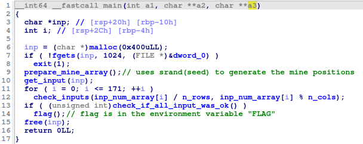

# mine-game

Given is a binary file `file` and an ip + port.

The file is an ELF executable:
`file: ELF 64-bit LSB shared object, x86-64, version 1 (SYSV), dynamically linked, interpreter /lib/ld-musl-x86_64.so.1, stripped`

Notice the unusual interpreter. This is the reason it can't be executed on most Ubuntu-flavored distros out of the box. It uses the libc implementation [musl](https://musl.libc.org/). On Ubuntu, musl can be installed via apt or by compiling the source code.

### Analyzing the code

The main function:

Basically, the program is a custom implementation of the popular game "minesweeper". A two dimensional array of 14 * 14 is initialized with 25 "bombs" at pseudo-random locations. The player passes a series of positions to the game. If the player hits a field with a mine, it explodes and the user loses the game. Only if all 14 * 14 - 25 = 171 places without mines have been entered correctly the player wins the game and gets the flag.

The flag is stored in an environment variable "FLAG", thus it is only accessable on the server and cannot be extraced from the sole binary.

Since the mine positioning is based on `srand()` call, it is neccessary that we use the same implemenation (e.g. glibc) which is used on the server. Luckily, it works with the standard musl package available by apt.

### Obtaining the mine array
When we are at the point where we can run the binary locally, we simply attach gdb and set a breakpoint after the mine array has been initialized. We then inspect the memory and dump the whole array from memory, for example with: `x/200x mine_array_addr` (the address is not known beforehand due to dynamic linking of the program).

### Computing the input string
Every entry which equals 42 ('*') represents a bomb. The program expects 171 integers separated by semicolon. Every integer is a flattened index in the mine array (e.g. 6 = (0,6), 14 = (1,0)). With the program `solve.py` we enter the raw array obtained with the debugger and get a nicely formatted input string to win the flag:
`0;1;2;3;4;5;6;7;8;9;10;11;12;13;14;16;17;18;20;21;23;24;26;27;28;29;30;31;32;33;34;35;36;37;38;39;40;41;42;43;45;47;48;49;51;52;53;55;56;57;58;60;61;62;63;64;65;66;67;68;69;71;72;73;74;75;76;78;79;80;81;82;83;84;85;87;88;89;90;91;92;93;95;96;97;98;99;100;102;103;104;105;106;107;108;109;110;112;113;114;116;117;118;119;120;121;122;124;125;126;127;128;129;130;131;132;133;134;135;136;137;138;139;140;141;143;144;145;147;148;149;150;151;152;153;154;155;156;157;158;159;160;161;164;165;166;167;168;169;170;171;172;173;174;175;177;178;179;180;181;183;185;186;188;189;190;191;192;193;194;195`
